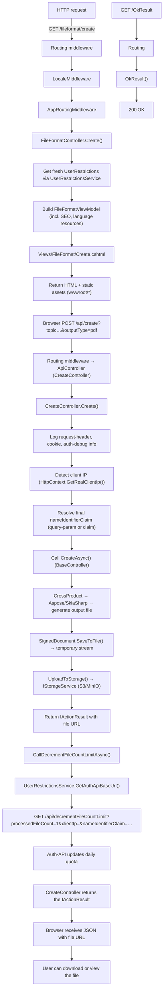

```mermaid
flowchart TD
    %% entry points
    A[HTTP request] -->|GET /fileformat/create| B[Routing middleware] 
    B --> C[LocaleMiddleware] 
    C --> D[AppRoutingMiddleware] 
    D --> E["FileFormatController.Create()"] 

    %% UI rendering
    E --> F[Get fresh UserRestrictions via UserRestrictionsService] 
    F --> G["Build FileFormatViewModel (incl. SEO, language resources)"] 
    G --> H[Views/FileFormat/Create.cshtml] 
    H --> I["Return HTML + static assets (wwwroot/*)"]

    %% client interacts with UI (editor) → POST to API
    I --> J["Browser POST /api/create?topic…&outputType=pdf"] 
    J --> K["Routing middleware → ApiController (CreateController)"] 

    %% API pipeline
    K --> L["CreateController.Create()"] 
    L --> M["Log request‑header, cookie, auth‑debug info"] 
    M --> N["Detect client IP (HttpContext.GetRealClientIp())"] 
    N --> O["Resolve final nameIdentifierClaim (query‑param or claim)"] 
    O --> P["Call CreateAsync() (BaseController)"] 
    P --> Q["CrossProduct → Aspose/SkiaSharp → generate output file"] 
    Q --> R["SignedDocument.SaveToFile() → temporary stream"] 
    R --> S["UploadToStorage() → IStorageService (S3/MinIO)"] 
    S --> T[Return IActionResult with file URL] 

    %% quota handling
    T --> U["CallDecrementFileCountLimitAsync()"] 
    U --> V["UserRestrictionsService.GetAuthApiBaseUrl()"] 
    V --> W["GET /api/decrementFileCountLimit?processedFileCount=1&clientIp=&nameIdentifierClaim=…"] 
    W --> X["Auth‑API updates daily quota"] 

    %% final response
    X --> Y[CreateController returns the IActionResult] 
    Y --> Z[Browser receives JSON with file URL] 
    Z --> AA[User can download or view the file]

    %% health‑check path
    B2[GET /OkResult] --> C2[Routing] --> D2["OkResult()"] --> Z2[200 OK]

```
